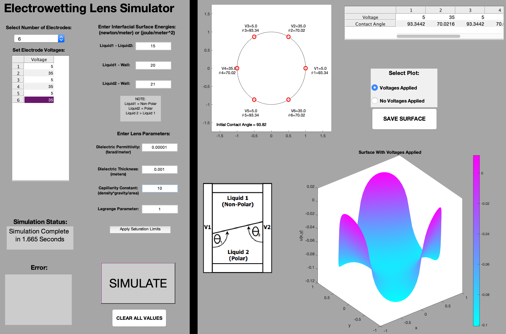

I wrote an Electrowetting Lens Simulator in MATLAB for modeling liquid-liquid interface surfaces in electrowetting lenses. The code uses finite element analysis to solve the Young-Lipppmann equation, and is packaged in an easy to use GUI. This software was used to generate data for a publication investigating the use of electrowetting lenses as adaptive optics elements. 

You can read the publication [here](https://opg.optica.org/oe/fulltext.cfm?uri=oe-25-25-31451&id=379230), or check the code out [here](https://github.com/ConMark/Electrowetting-Lens-Simulator).

