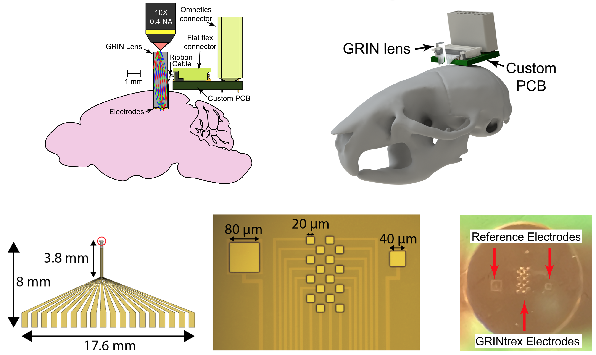

The GRINtrex is the next generation of the GRINtrode, and is still in development.  

Through collaboration with a team of electrical engineers, the GRINtrex incorporates an optically transparent microelectrode array adhered to the implanted face of the GRIN lens. This design provides electrical recording sites *throughout* the imaging field, improving overlap between the modalities. 

