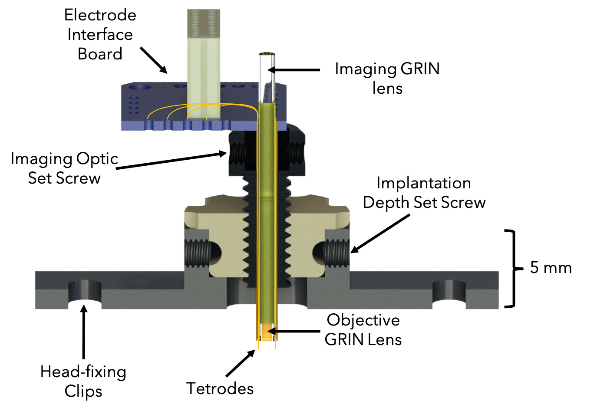

For my PhD thesis, I wanted to build a neural implant that could simultaneously perform 2-photon GCaMP imaging and electrophysiology in overlapping populations of neurons. I decided on a GRIN lens based device with tetrodes surrounding the lens. I named this device the GRINtrode. 

The goal of the GRINtrode was to record from the same neurons optically and electrically to investigate intricacies of each modality. 

By fiber coupling the device to a coherent imaging fiber bundle, I was able to use the GRINtrode in freely moving animals. 

You can read the publication [here](https://doi.org/10.1117/1.NPh.9.4.045009)

    <video src="../assets/GRINtrode.mp4" width="32%" controls></video>
    
    

