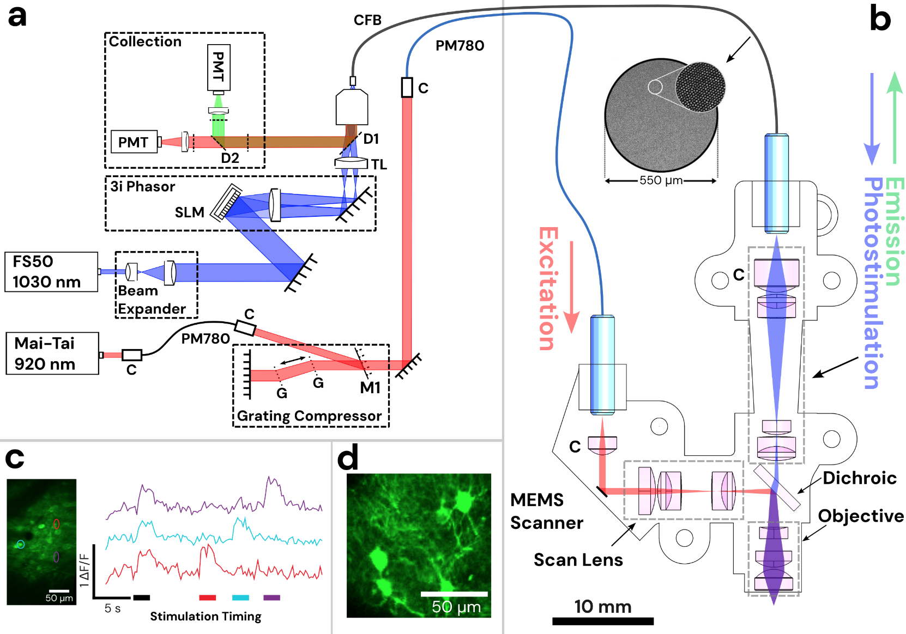

The Opto2P-FCM is a miniaturized MEMS scanner-based two-photon microscope that incorporates patterned holographic optogenetic stimulation capabilities, suitable for use in freely moving animals. The Opto2P-FCM is a first of its kind device that pushes our capabilities in animal neuroscience experiments. 

2p excitation light is delivered to the device through a PM fiber, optogenetic patterns are generated using a spatial light modulator and delivered through a coherent imaging fiber bundle, and emission light is collected through the same fiber bundle. 

The paper is still in submission, but you can read the preprint [here](https://www.biorxiv.org/content/10.1101/2024.10.21.619528v1)

    <video src="../assets/Opto2PFCMvideo.mp4" width="920" height="720" controls></video>
    

